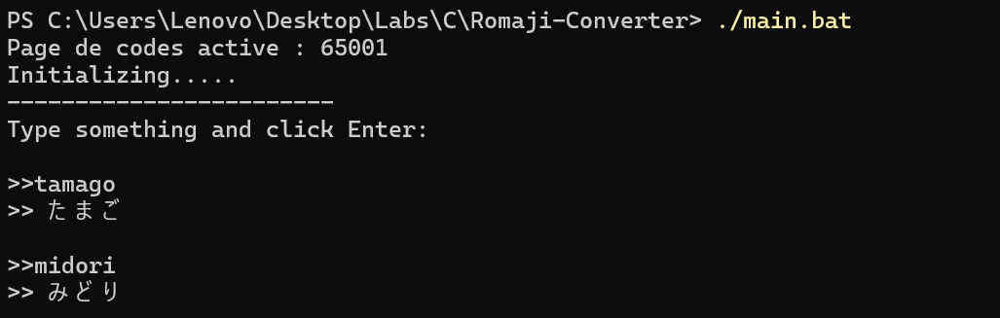

# 🈁 Romaji to Hiragana Converter

This project helps **beginners learning Japanese Hiragana** by allowing them to convert **Romaji (Latin characters)** into **Hiragana**.  
You can type something like:

```
konnichiwa → こんにちは  
arigatou → ありがとう  
sensei → せんせい  
```

The tool makes it easier for learners to understand **Japanese pronunciation and writing correspondence**.

---

## 🚀 Getting Started

Follow these steps to get a copy of the project up and running on your local machine.

### 🧩 Prerequisites

- A **C compiler** such as `gcc`
- A **Windows environment** (if using `main.bat`) or a terminal for Linux/macOS
- `git` installed for cloning the repository

---

### 📥 Installation

Clone the repository and move into the project folder:

```bash
git clone https://github.com/saadRouyass/Romaji-Converter.git
cd Romaji-Converter/
```

---

### ▶️ Run the Project

You can compile and run the converter manually or through the provided script.

#### Option 1 — Using the batch file (Windows)

```bash
./main.bat
```

#### Option 2 — Compile and run manually (Linux/macOS)

```bash
gcc src/main.c src/romaji_converter.c src/hash_table.c -o bin/main
cd bin
./main
```

Then, simply type Romaji text and see the Hiragana output in the console.



